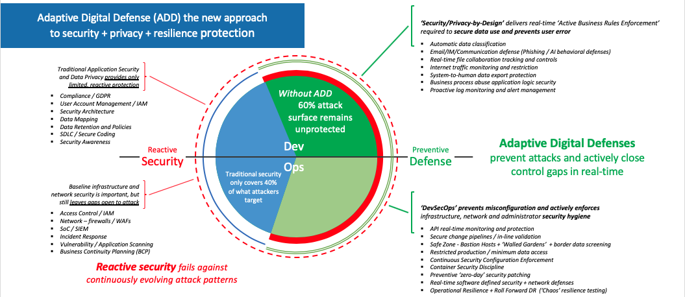
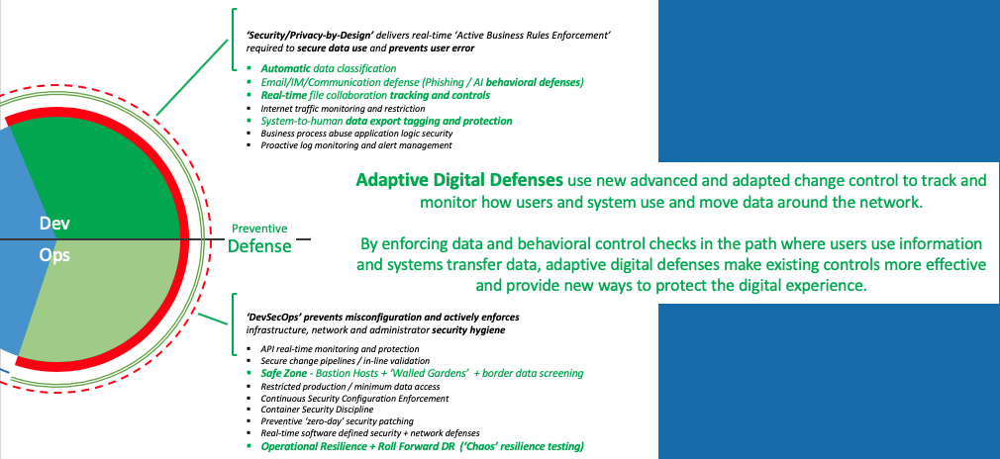

## Adaptive Digital Defence

Traditional security contcentrates security resources in technical computer and network protection, but with current hacker attack tactics this only covers 40% of what attackers can target.

Adaptaive Digital Defence is a new and different game plan to prevent attacks by using security controls at critical points of risk to actively close control gaps in real-time.

Download the PDF [Adaptive Digital Defence](RFC-AdaptiveDigitalDefence.v1.pdf)

Please take a closer look at this approach and [tell me what you think](sayhi.md). _<< daveinthecity >>_
